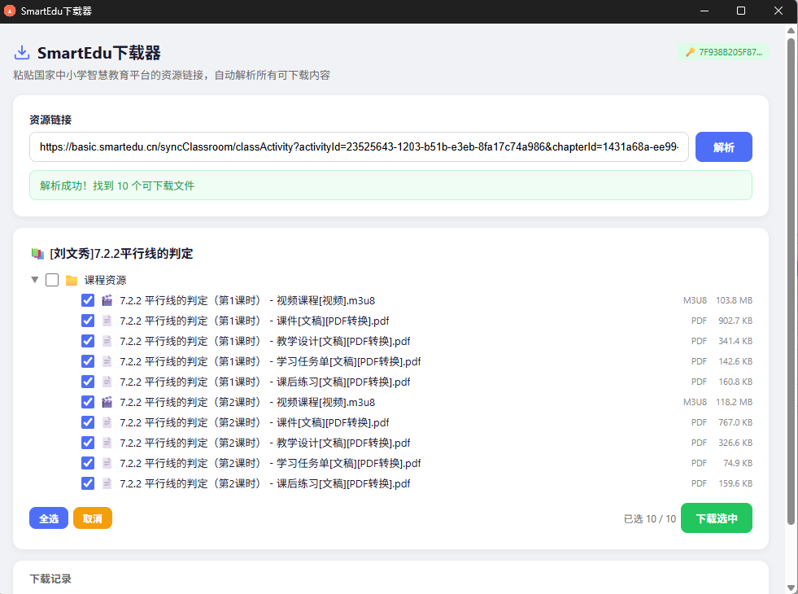

# SmartEdu 下载器   -孩子读书，整了这个。

跨平台桌面应用，下载 [国家中小学智慧教育平台](https://basic.smartedu.cn) 上的教材、课件、作业、课程活动、实验课、视频等资源。

基于 Electron 构建，支持 Windows / macOS / Linux。

---

## 功能

- **支持多种资源类型** — 教材、同步课程、基础作业、课件、一堂课、实验课、精品课、专题课程
- **自动发现所有资源** — 自动识别 API 返回的所有资源分类，无需硬编码白名单
- **树形文件选择** — 自动解析资源结构，勾选需要下载的文件
- **并发批量下载** — 保持原目录结构，同时下载多个文件（可调 1/2/4/8 路并发）
- **断点续传** — 下载中断后重新下载，从断点继续，无需重头开始；已下载完整的文件自动跳过
- **失败自动重试** — 网络波动、超时、服务器 5xx/429 时自动指数退避重试；受限资源 401/403 自动携带 Token 重试
- **可随时取消** — 下载过程中可一键取消整个批次
- **磁盘空间预检** — 开始下载前检查剩余空间，不足时警告
- **实时进度** — 总进度按字节计算，显示当前文件、实时下载速度
- **Access Token** — 设置令牌后可下载受限资源
- **自动格式适配**
  - 课件/教案（pptx/docx）→ 识别 PDF 回退，自动标注 `[PDF转换]`
  - 文档/表格/压缩包 → 直接下载源文件
  - 图片/音频 → 支持 jpg/png/gif/mp3/wav/aac 等格式
- **视频下载已取消** — 见下方说明

## 截图



## 下载

从 [Releases](https://github.com/joimjnbg/smartedu-downloader/releases) 页面下载最新版本。

| 平台 | 文件 | 说明 |
|------|------|------|
| Windows x64 | `SmartEdu下载器-win-x64.exe` | 64 位系统 |
| Windows x86 | `SmartEdu下载器-win-ia32.exe` | 32 位系统 |
| macOS x64 | 需从源码构建 | `npm run build:mac-x64` |
| macOS ARM | 需从源码构建 | `npm run build:mac-arm64` |
| Linux x64 | 需从源码构建 | `npm run build:linux-x64` |

> 目前仅提供 Windows 预编译版本（x64 和 x86 均可用）。其他平台用户请参考「从源码构建」章节自行编译。

## 快速开始

1. 打开 [basic.smartedu.cn](https://basic.smartedu.cn) 并登录
2. 复制任意资源页面的 URL
3. 粘贴到 SmartEdu 下载器 → 点击「解析」
4. 勾选需要下载的文件 → 点击「下载选中」
5. 选择保存目录，等待下载完成

### 整册教材批量下载（教材目录）

教材栏目（`tchMaterial`）支持按分类目录批量下载，无需逐本粘贴链接：

1. 复制教材栏目的目录链接（网址含 `defaultTag` 参数，如 `https://basic.smartedu.cn/tchMaterial?defaultTag=...`）
2. 粘贴到「教材目录」输入框 → 点击「加载目录」
   - 首次会下载教材全量元数据（约 3600 本，10~40 秒），之后使用本地缓存秒开
3. 按「学段 → 学科 → 版本 → 年级 → 册次」逐层展开，勾选需要的教材
4. 点击「将选中教材加入下载列表」，解析完成后在下方结果区勾选并下载
5. 保存目录将自动按「学段/学科/版本/年级/册次/书名.pdf」组织结构

### 下载受限资源

部分资源（如课程视频、加密文档）需要 Access Token：

1. 在浏览器中登录 basic.smartedu.cn
2. 按 `F12` 打开开发者工具 → 「控制台」Console
3. 粘贴以下代码，按回车：

```js
(function(){
  const a=Object.keys(localStorage).find(k=>k.startsWith("ND_UC_AUTH"));
  if(!a) return console.error("请先登录");
  const t=JSON.parse(localStorage.getItem(a));
  console.log(JSON.parse(t.value).access_token)
})()
```

4. 复制输出的 Token 值
5. 在 SmartEdu 下载器中点击右上角 `🔑 未设置` → 粘贴 Token → 保存

## 从源码构建

### 前置要求

- Node.js ≥ 18
- npm ≥ 9

### 步骤

```bash
# 克隆仓库
git clone https://github.com/joimjnbg/smartedu-downloader.git
cd smartedu-downloader

# 安装依赖
npm install

# 运行测试（纯逻辑层，无需 Electron）
npm test

# 启动开发模式
npm start

# 构建分发版
npm run build:win-x64      # Windows x64 便携版（输出到 out/）
npm run build:mac-x64      # macOS Intel
npm run build:mac-arm64    # macOS Apple Silicon
npm run build:linux-x64    # Linux x64
```

### 构建脚本

| 命令 | 产物 | 输出路径 |
|------|------|---------|
| `npx electron-builder --win portable --x64 --ia32` | Windows x64 + x86 便携版 | `out/SmartEdu下载器-win-x64.exe` + `out/SmartEdu下载器-win-ia32.exe` |
| `npm run build:win-x64` | Windows x64 便携版 | `out/SmartEdu下载器-win-x64.exe` |
| `npm run build:win-arm64` | Windows ARM64 便携版 | `out/SmartEdu下载器-win-arm64.exe` |
| `npm run build:mac-arm64` | macOS ARM (M系列) zip | `out/SmartEdu下载器-mac-arm64.zip` |
| `npm run build:linux-x64` | Linux AppImage | `out/SmartEdu下载器-linux-x64.AppImage` |

> 每个 build 命令结束后会自动运行 `check:asar` 校验脚本（`node scripts/check-asar.js`），
> 检查 `main.js` 的依赖是否全部打进 `app.asar`，防止发布后运行时缺模块崩溃。

## 测试

纯 Node 测试，无需启动 Electron：

```bash
npm test
```

- `tdd-logic.js` — 逻辑层 67 项：URL 类型识别、资源提取、关系解析
- `tdd-downloader.js` — 下载引擎 19 项：本地 HTTP 服务模拟 5xx 重试、Token 回退、断线续传（Range）、超时、截断检测、并发上限、批量取消

## 项目结构

```
smartedu-downloader/
├── main.js          # Electron 主进程（IPC路由、资源解析、批量下载调度、Token管理）
├── lib.js           # 纯逻辑层（URL检测、资源提取、关系解析 — 可脱离Electron测试）
├── net.js           # HTTP 客户端层（重试/超时/Token回退 — 可脱离Electron测试）
├── downloader.js    # 下载引擎（并发队列、断点续传、退避重试、取消 — 可脱离Electron测试）
├── renderer.js      # 渲染进程（UI、树形选择、下载进度、取消）
├── preload.js       # 预加载桥接（IPC通信）
├── index.html       # 界面布局
├── package.json     # 项目配置
├── tdd-logic.js     # 逻辑层单元测试（67项）
├── tdd-downloader.js# 下载引擎测试（19项，本地HTTP服务模拟断线/超时/重试/续传）
└── icon.png         # 应用图标
```

## 工作原理

1. 粘贴 URL → `detectType()` 识别资源类型
2. 调用对应 API 端点获取 JSON 数据（失败自动重试，受限资源自动携带 Token）
3. 解析 `ti_items` 中的资源项，提取下载 URL（按质量优先级排序）
4. 解析 `relations` 中的关系资源（自动发现所有分类，无需硬编码白名单）
5. 构建资源树 → 用户勾选 → 并发批量下载（支持断点续传、失败重试、随时取消）
6. 下载时重试机制：先尝试无认证请求，若 401/403 则使用 Token 重试

### 支持的 URL 类型

| URL 路径 | 类型 | 识别的参数 | API 端点 |
|---------|------|-----------|---------|
| `/tchMaterial/detail` | 教材 | `contentId` | `s-file-1/tch_material/details` |
| `/syncClassroom/classActivity` | 课程活动 | `activityId` | `s-file-2/national_lesson/resources/details` |
| `/syncClassroom/prepare/detail` | 课件 | `resourceId` | `s-file-2/prepare_sub_type/resources/details` |
| `/syncClassroom/prepare/detail` | 一堂课 | `lessonId` | `s-file-1/prepare_lesson/resources/details` |
| `/syncClassroom/experimentLesson` | 实验课 | `courseId` | `s-file-1/experiment/resources/details` |
| `/syncClassroom/basicWork/detail` | 基础作业 | `contentId` | `s-file-1/special_edu/resources/details` |
| `/qualityCourse` | 精品课 | `courseId` | `s-file-1/elite_lesson/resources` |
| `/schoolService/detail` | 专题课程 | `thematic_course` + `contentId` | `s-file-1/special_edu/thematic_course` |

> 从 v1.3.0 开始，URL 路径采用 `URL API` 精确匹配参数，不再依赖字符串 `includes()`。

### 关于视频下载

**v1.3.0 起已取消视频下载功能。** 原因：

平台视频使用 AES-128 加密，密钥服务器 `ndvideo-key.ykt.eduyun.cn` 部署了**华为 WAF (Web Application Firewall) JS Challenge**。该 WAF 需要真实浏览器环境执行 JavaScript 才能通过验证。Electron 环境（以及任何非完整浏览器的 HTTP 客户端）无法可靠绕过。

如需下载视频，请在浏览器中打开页面后手动保存，或使用浏览器扩展程序。

## 注意事项

- **视频下载**：v1.3.0 起已取消。平台使用 AES-128 + 华为 WAF，无法可靠解密。
- **课件/教案**：部分资源不再提供源文件（pptx/docx），平台只返回 PDF 转换版，下载后自动标注 `[PDF转换]`
- **断点续传**：中断后重新选择同一保存目录下载时，已下载部分会自动续传（要求服务器支持 Range）
- **Access Token**：会保存在本地 `userData/token.json`，重启后仍有效

## 技术栈

- [Electron](https://www.electronjs.org/)
- [electron-builder](https://www.electron.build/)
- Node.js HTTPS 原生模块

## 许可

MIT
